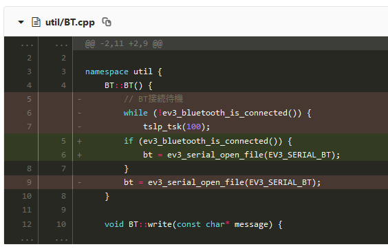

# もじゃと学ぶGit入門
バージョン管理のありがたみが深い


---

# この講座では
* この講座ではGitやバージョン管理の基礎について学びます
* 便利なGUI Toolは存在しますが、
  エンジニアなんだし最初はコマンドで慣れましょう

## 目次
1. バージョン管理とは
2. Gitとは
3. 環境構築
4. 使ってみよう
5. Githubのアカウントを登録しよう

---

# 1. バージョン管理とは
過去の内容を上書きせずに取っておいて、後からいつでも戻せる状態にしておくこと

## こんなときに救われる
* やべえミスったまま保存した
* なんか変えたら動かなくなったがどこ弄ったか思い出せん
* これやっぱ前のほうがよくない？
* もともとここどうなってたんだっけ

---

# 手動じゃダメなの？
## やれるもんならやってみろよ


### 真面目な話をすると
* 変更履歴が全くわからない
* どこが変わったかすらわからない
* いざロールバックするとき手でコピペ貼り付けでもすんの？

---

# Gitとは
* IT現場で最も使われているバージョン管理ツール
* LinusがLinuxを作るついでに作った
* ファイルごとの差分を持っているので、
	* 省スペース（丸々バックアップしてるわけじゃない）
	* ファイルごとに任意のバージョンまで戻れる
	* 過去の編集記録と編集者がわかる
* ツリー状にブランチが別れていくのでGitツリーとか言われる

---

# Gitツリーのイメージ

※下から上に見る

---

# 変更箇所のイメージ

緑が新規行、赤が削除行

---

# 環境構築
1. Git for WindowsをDL
	[https://gitforwindows.org/]()
2. インストーラの指示に従ってインストール
	* とりあえず全部デフォルトでいい
	* こだわるなら勝手にやれ
3. Powershellを起動して、
	`git config --global user.name "名前とかIDとか半角英数で"`
    `git config --global user.email "メアド 嫌ならダミーで適当に"`
    どちらも基本公開されるものなので恥ずかしいものにしない

---

# 使ってみよう
## 1. 既存のプロジェクトを手元にコピーする（初回）
1. デスクトップをShift+右クリックで
	「Git Bash Here」
2. `git clone https://github.com/s10akir/hello-git.git`で、
	練習用プロジェクトを落としてくる
	* これはGithubに用意した練習用のリポジトリ。
    * こんな感じでソースコードを共有できる。
3. `cd hello-git`で作られたディレクトリの中へ移動

---

# 中身を確認しよう
1.`ls -a`でファイル一覧を見てみる
```
HelloGit.txt
README.md
.git/
```
があるはず。
隠しディレクトリである.git/以下にバックアップや設定、ログ等が入っているので、絶対に手で変更してはいけない。

---

# 編集ログを見てみよう
1. `git log`で編集ログを表示する
```
commit f61535略 (HEAD -> master)
Author: Akira Shinohara <k017c1067@it-neec.jp>
Date:   Wed Jan 9 23:07:48 2019 +0900

    [new] 練習用テキストファイルを作成

commit 2919c5略 (origin/master, origin/HEAD)
Author: Akira Shinohara <34061817+s10akir@略>
Date:   Wed Jan 9 23:03:07 2019 +0900

    Initial commit
```
誰がいつどんな変更を行ったのかがわかる。
最初のコミットのメアドが違うのはGithub上でやったからなので気にしない。

---

# 編集ログを詳しく見てみよう
1. `git log -p`で詳しい編集ログを表示する
```
commit f61535略 (HEAD -> master)
Author: Akira Shinohara <k017c1067@it-neec.jp>
Date:   Wed Jan 9 23:07:48 2019 +0900

    [new] 練習用テキストファイルを作成
```
```
diff --git a/HelloGit.txt b/HelloGit.txt
new file mode 100644
index 0000000..a605426
--- /dev/null
+++ b/HelloGit.txt
@@ -0,0 +1,2 @@
+Hello Git World!
+

以下略
```
「私が」「HelloGit.txtを」「新規作成して」「2行記入した」
という記録が確認できる。

---

# ファイルを書き換えてみよう
1. デスクトップにあるhello-gitフォルダの中のHelloGit.txtを
    適当なエディタで編集する
	`Hello Git World!` => `Bye Git World!`に書き換える
2. `git diff`で編集内容を確認する
```
diff --git a/HelloGit.txt b/HelloGit.txt
index a605426..811f04d 100644
--- a/HelloGit.txt
+++ b/HelloGit.txt
@@ -1,2 +1,2 @@
-Hello Git World!
+Bye Git World!
```
どこが変わったのかちゃんと確認できる

---

# 変更を確定させよう
実はまだこの変更は新しいバージョンとして確定していない。
1. `git add HelloGit.txt`でコミット（確定）するものを選択
2. `git commit -m "[change] 文章を変更"` でコミット
3. `git log -p`でログに残ったことを確認
```
commit (ここはハッシュなので違うものになる) (HEAD -> master)
Author: Akira Shinohara <k017c1067@it-neec.jp>
Date:   Wed Jan 9 23:26:23 2019 +0900

    [change] 文章を変更
```
```
diff --git a/HelloGit.txt b/HelloGit.txt
index a605426..811f04d 100644
--- a/HelloGit.txt
+++ b/HelloGit.txt
@@ -1,2 +1,2 @@
-Hello Git World!
+Bye Git World!
```

---

# 変更をロールバックしてみよう
**※実際の開発では絶対に個人の判断で行わないこと。**
　全体に影響を及ぼす可能性がある。
1. `git reset HEAD^ --hard`で最新のコミットを取り消す
```
HEAD is now at f615358 [new] 練習用テキストファイルを作成
```
2. `git log`でさっきのコミットが無くなったことを確認する
3. HelloGit.txtを開いてロールバックされたことを確認する

---

# まとめ
Gitを正しく扱えるようになって
トラブルに強いプロジェクトを構築しましょう。


\# 変更の共有の仕方はGithubのアカウントを取得したら